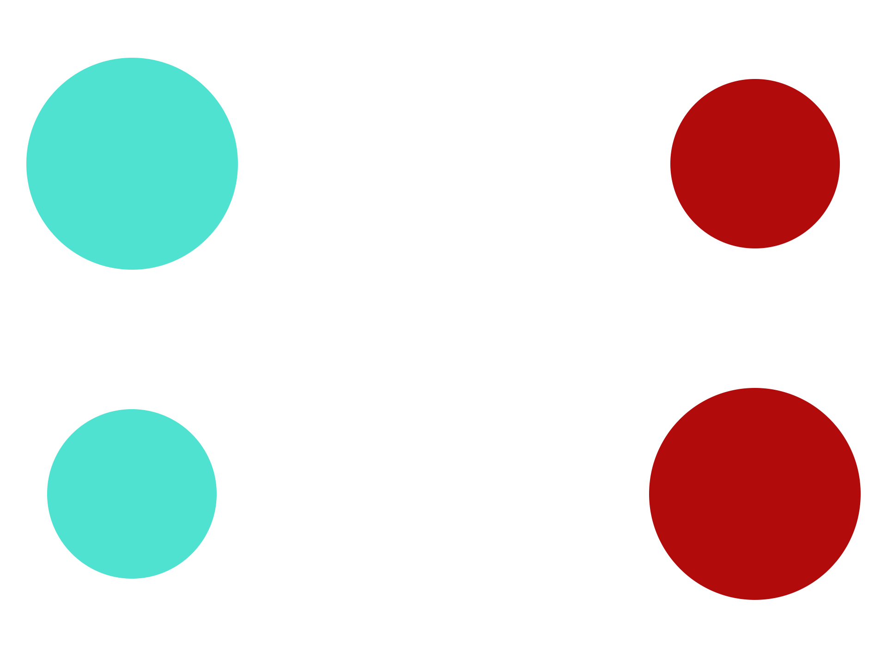

# **HSV COLORSPACE**

Atividade de avaliação para disciplina Disruptive Architectures IOT e IA - FIAP.  

#### **Nome dos alunos**
- Danilo Maia Boccomino - RM85473
- Vinicius Barbosa Santos - RM84401

#### **Turma**
2TDSA

#### **Ano**
2021

&nbsp;

## **O PROJETO**
O projeto consiste em trabalhar com o conceito de python-visão estudado em sala de aula, trazendo ferramentas como Python e bibliotecas como Open CV que permite utilizar funções para determinar espaço-cor de uma imagem, trabalhando com segmentações do mesmo através da conversão HSV da cor.

Com este material é possível mapear um elemento da imagem trabalhando com máscara de recorte e aplicando por cima informações como centro de massa calculado do elemento selecionado.

**Imagem de exemplo:**

Neste projeto, vamos segmentar entre cores e também entre os tamanhos do círculos.
[Link para o vídeo demonstrativo no youtube](https://www.youtube.com/watch?v=AjjaP3QwvVs)

&nbsp;

## **REFERÊNCIAS**
Foram utilizados alguns links para consulta de cálculos trigonométricos:
- https://stackoverflow.com/questions/21483999/using-atan2-to-find-angle-between-two-vectors
- https://www.todamateria.com.br/seno-cosseno-e-tangente/
- https://felipemeganha.medium.com/como-calcular-%C3%A2ngulos-com-python-e-opencv-4db69c1cee71
- https://www.educamaisbrasil.com.br/enem/matematica/angulos
- https://sabermatematica.com.br/angulos-entre-duas-retas.html
- https://mundoeducacao.uol.com.br/matematica/angulo-formado-entre-duas-retas.htm